<h1 align="center">Marcos Vinícius</h1>

  

  
  
  
 

---

Software engineer with 3 years building multi-tenant B2B SaaS at scale — data modeling, backend, real-time and frontend. I care about reliability, application security and privacy by design, and I treat AI as a dependency that can fail: deterministic fallback, usage accounting and per-tenant limits.

  

### Currently

**BeeCRM** · omnichannel CRM — top individual contributor. Shipped voice calling over the Meta WhatsApp Cloud API (WebRTC + Coturn) from scratch, plus the AI assistant and the project's security gate.
**Folheto Digital** · WhatsApp marketing SaaS — lead frontend (~69% of commits), 14 domain modules, i18n rollout to 3 locales on a live product.
**SIM** · occupational health SaaS — ~25% of repo history. Table design system on TanStack Table (13 screens) and end-to-end white-labeling.

### Stack

Also: BullMQ · RabbitMQ · Socket.IO · WebRTC + Coturn · OpenAI &amp; Anthropic APIs · Playwright · Vitest · Sentry · Turborepo

### Stats

<picture>
  <source media="(prefers-color-scheme: dark)" srcset="https://raw.githubusercontent.com/vin1i/vin1i/output/snake.svg" />
  <source media="(prefers-color-scheme: light)" srcset="https://raw.githubusercontent.com/vin1i/vin1i/output/snake-light.svg" />
  
</picture>

  

  
  

Systems Analysis and Development, Universidade Maurício de Nassau (2025) · 🇧🇷 Native · 🇺🇸 Intermediate
